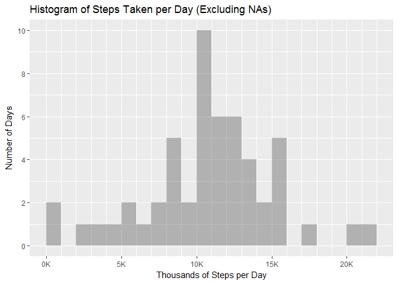
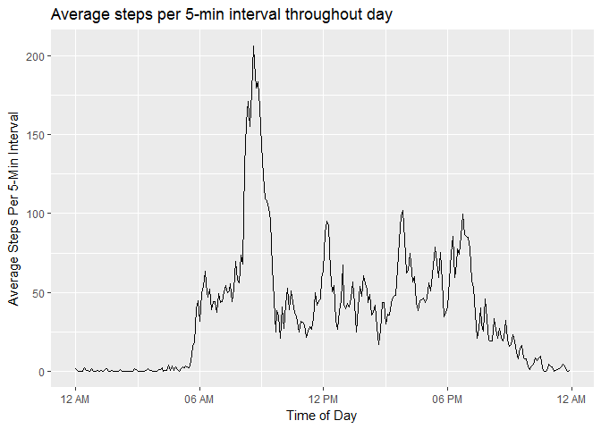
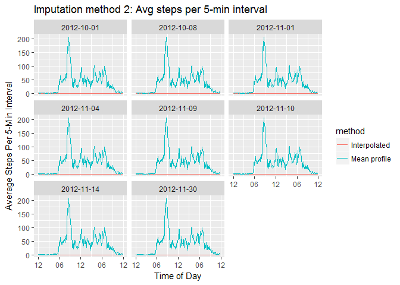
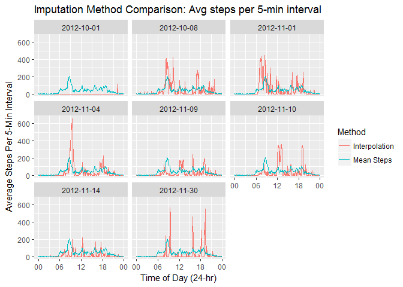
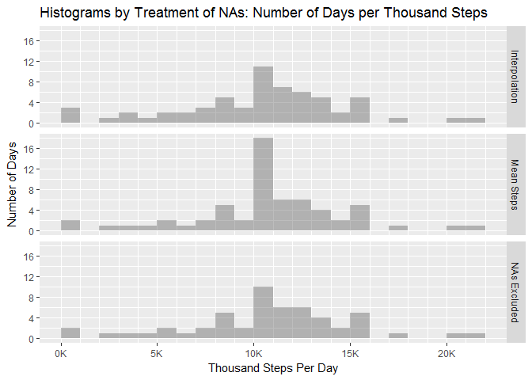
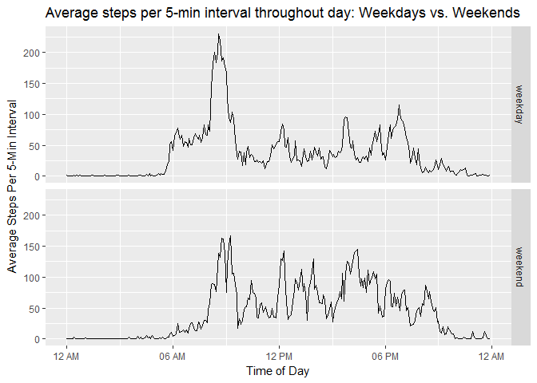

Reproducible Research: Peer Assessment 1
================
Paul Clark
December 25, 2016

-   [Introduction](#introduction)
    -   [1. Load packages and read data](#load-packages-and-read-data)
    -   [2. Plot histogram of number of steps taken per day](#plot-histogram-of-number-of-steps-taken-per-day)
    -   [3. Display mean and median steps per day](#display-mean-and-median-steps-per-day)
    -   [4. Plot time series of average steps per interval](#plot-time-series-of-average-steps-per-interval)
    -   [5. Report the 5-minute interval with maximum average steps](#report-the-5-minute-interval-with-maximum-average-steps)
    -   [6. Impute missing data](#impute-missing-data)
    -   [7. Evaluate distribution of Steps Per Day with imputed data](#evaluate-distribution-of-steps-per-day-with-imputed-data)
    -   [8. Compare average time series of weekday and weekend steps per interval](#compare-average-time-series-of-weekday-and-weekend-steps-per-interval)
    -   [9. Confirm visibility of all code used](#confirm-visibility-of-all-code-used)
-   [Appendix: Session Info for Reproducibility of Results](#appendix-session-info-for-reproducibility-of-results)

### Introduction

This assignment uses data from a personal activity monitoring device. The data was collected from an individual during October and November, 2012, and includes the number of steps taken in 5 minute intervals. Here, we explore the data to:

-   Understand the distribution of steps per day
-   Profile the number of steps per 5-min period, averaged over the two months
-   Understand the impact of imputing missing values
-   Evaluate the differences between step profiles on weekdays vs. weekends

This document is structured so as to demonstrate fulfillment, in order, of the 9 requirements for a successful submission. (These are listed in the the section titled ***Commit containing full submission*** within the assignment [***Review Criteria***](https://www.coursera.org/learn/reproducible-research/peer/gYyPt/course-project-1).)

------------------------------------------------------------------------

#### 1. Load packages and read data

Before starting, we load required packages and read the data. We also create a directory for permanent storage of the figures that will be created.

``` r
# set CRAN mirror for package installation
mir <- "https://cloud.r-project.org"
# Load required packages
if (!require(dplyr)) {install.packages("dplyr", repos = mir); require(dplyr)}
if (!require(ggplot2)) {install.packages("ggplot2", repos = mir); require(ggplot2)}
```

``` r
# Read in the data from the zipped file
conxn <- unz("activity.zip","activity.csv")
# Note: The file consists of 3 columns of data: steps, date, and 5-min interval.
activity <- read.csv(conxn, colClasses = c("integer", "character", "integer"))
# `read.csv` closes the conxn, but we also remove it from our environment.
rm(conxn)
```

``` r
# Create directory for figures
if (!file.exists("figures")) {dir.create("figures")}
```

------------------------------------------------------------------------

#### 2. Plot histogram of number of steps taken per day

To obtain the histogram, we first group the `activity` data frame by date, and sum over the steps taken on each date. (Note: In doing so, it is important to set `na.rm = FALSE` in `sum`, as we have found that otherwise, `dplyr::summarize` will include zeroes for dates with `NA`s. We want these dates to be properly identified as containing missing data, so they can be omitted from subsequent calculation.)

``` r
# Computing steps by date
stepsbydt_na <- activity %>% group_by(date) %>% summarize(StepsPerDay = sum(steps, na.rm = FALSE))
```

We then plot the desired histogram using `ggplot2::ggplot`, and save it in the figures directory. We set `na.rm = FALSE`, so that explicit warning messages are generated to confirm the number of days for which the data contains `NA`s.

``` r
# Plotting the histogram
(histNoNA <- ggplot(stepsbydt_na, aes(StepsPerDay/1000)) + stat_bin(binwidth = 1, center = 0.5,
        closed = "right", alpha = 0.4, na.rm = FALSE) + 
        scale_x_continuous(minor_breaks = seq(0,22,1), labels = function(x){paste0(x, "K")}) +
        scale_y_continuous(breaks = seq(0,20,2)) +
        labs(x = "Thousands of Steps per Day", y = "Number of Days", title =
        "Histogram of Steps Taken per Day (Excluding NAs)"))
```

    ## Warning: Removed 8 rows containing non-finite values (stat_bin).



------------------------------------------------------------------------

#### 3. Display mean and median steps per day

We now compute the mean and median steps for the data in the above histogram. We use the `summary` function for this, as it gives a bit more information than `mean` and `median`. The median 10765 and mean 10766.19 are quite close, consistent with a fairly symmetrical distribution.

``` r
print(format(summary(stepsbydt_na$StepsPerDay, digits = 7, na.rm = TRUE), big.mark = ","), quote = FALSE)
```

    ##      Min.   1st Qu.    Median      Mean   3rd Qu.      Max.      NA's 
    ##     41.00  8,841.00 10,765.00 10,766.19 13,294.00 21,194.00         8

------------------------------------------------------------------------

#### 4. Plot time series of average steps per interval

We use `dplyr::group_by` to group by interval, then `dplyr::summarize` to average steps across all days for each interval. Here, we set `na.rm = TRUE` to eliminate `NA` results. (Unless we do this, our `mean` for every interval will be `NA`: as we will see in section (6), for some days, all intervals are `NA`.) To make it easier to check the results vs. experience, we also normalize the `steps` variable to average `StepsPerMin`, dividing by 5.

``` r
stepsbyint <- activity %>% group_by(interval) %>% summarize(StepsPerMin = mean(steps, na.rm = TRUE)/5)
```

To plot times in 'clock' format, `ggplot2` functions require time variables to be of class `POSIXct`. Therefore, we need to reformat the interval information. This is not hard, because we have read it in as an integer representing 24-hour clock time, not number of minutes. Note the break between 55 and 100, indicative of clock time (i.e., 55 and 100 represent 0:55 and 1:00).

``` r
stepsbyint$interval[9:15]
## [1]  40  45  50  55 100 105 110
```

As preparation for conversion to `POSIXct`, we first change the integers to clock times in *character* format. For that, we create a reformatting function and vectorize it so that it can be passed to `dplyr::transmute`.

``` r
# Definition of function to change interval into a character time of day
mktime <- function(tm) {
        digit4_tm <- paste0(paste0(rep("0", 4 - nchar(tm)), collapse = ""), tm, collapse = "")
        digit4_tm <- paste0(substr(digit4_tm, start = 1, stop = 2), ":", substr(digit4_tm, start = 3, stop = 4))
}
# Vectorize fn and use in transmute
vtime <- Vectorize(mktime, SIMPLIFY = TRUE, USE.NAMES = FALSE)
stepsbyintchar <- stepsbyint %>% transmute(time = vtime(interval), StepsPerMin)
```

Now the intervals are expressed as standard 24-hr clock times:

``` r
format(head(stepsbyintchar), digits = 2)
```

    ##    time StepsPerMin
    ## 1 00:00       0.343
    ## 2 00:05       0.068
    ## 3 00:10       0.026
    ## 4 00:15       0.030
    ## 5 00:20       0.015
    ## 6 00:25       0.419

Next, we convert to `POSIXct` and create the plots (one for display, one for safe-keeping). Note that `POSIXct` times must include a date. However, the date is of no consequence for this plot (so long as we do not use a day with changes to/from Daylight Savings Time). Therefore we prepare the variable `plottime` from `time` by appending the first date of the period in question, on which we know no conversion to/from DST occurs:

``` r
stepsbyintchar$plottime <- paste("2012-10-01", stepsbyintchar$time)
# convert character time to actual dttm (POSIXct) value
stepsbyinttm <- stepsbyintchar %>% transmute(plottime = as.POSIXct(plottime, format = "%Y-%m-%d %H:%M"), StepsPerMin)
# plot average number of steps taken over course of day, with time shown in clock hours
(stepTimeSeriesAvg <- ggplot(stepsbyinttm, aes(x = plottime, y = 5*StepsPerMin)) + geom_line() +
        scale_x_datetime(date_labels = "%I %p") + labs(x = "Time of Day",
        y = "Average Steps Per 5-Min Interval", 
        title = "Average steps per 5-min interval throughout day"))
```



------------------------------------------------------------------------

#### 5. Report the 5-minute interval with maximum average steps

``` r
(time_maxsteps <- stepsbyintchar[which.max(stepsbyintchar$StepsPerMin),])
```

    ## # A tibble: 1 × 3
    ##    time StepsPerMin         plottime
    ##   <chr>       <dbl>            <chr>
    ## 1 08:35    41.23396 2012-10-01 08:35

The time with maximum average steps is 08:35 on the 24-hour clock. During this interval, about 41.2 steps are taken per minute.

------------------------------------------------------------------------

#### 6. Impute missing data

The total number of missing values in the data set is given by the last table value of the `summary()` function (of course, we could also use `is.na()` to count missing values, but `summary()` gives more information):

``` r
summary(activity$steps, na.rm = FALSE)
```

    ##    Min. 1st Qu.  Median    Mean 3rd Qu.    Max.    NA's 
    ##    0.00    0.00    0.00   37.38   12.00  806.00    2304

Note that the number of `NA`s is exactly 8 days of missing data. To show that, we divide the total number of missing values by 24 hours per day and 12 intervals per hour, or 288 intervals per day:

``` r
(eight <- sum(is.na(activity$steps))/(12*24))
## [1] 8
```

The 8 days in question are the following:

``` r
with(activity, unique(date[is.na(steps)]))
## [1] "2012-10-01" "2012-10-08" "2012-11-01" "2012-11-04" "2012-11-09"
## [6] "2012-11-10" "2012-11-14" "2012-11-30"
```

We now create a new data set `activityimp` by replacing each missing `steps` value in `activity` with the value for the associated 5-minute interval computed by averaging across all days. Since we know the exact locations of all the `NA`s, we could replace the values rather simply. Instead, we use a more general procedure by following these steps:

1.  Use `is.na()` on `steps` in the `activity` data frame, subsetting on `interval`, to extract a vector of 2304 `interval` values associated with the NAs.
2.  Use `match()` to match the `interval` values to those in the data frame of average steps vs. interval, and extract the indices in that data frame associated with the matches.
3.  Use the indices to 'look up' the correct average value of `StepsPerMin` for every interval associated with an `NA`. Using `is.na()` again, put them in the right locations in the original data set (multiplied by 5).

``` r
# Create vector of interval values needing imputation
NAintervals <- activity[is.na(activity$steps), "interval"]
# Construct vector containing the corresponding indices in the `stepsbyint` dataframe
NAindices <- match(NAintervals, stepsbyint$interval) # Vector of length = number of NAs
# Use the index values in 'NAindices' to replace the NA values in the orginal data-set
# with those in the mean step per interval dataframe. (Multiply by 5, since we normalized
# the interval data in 'stepsbyint' to a value in average steps per minute).
activityimp <- activity
activityimp$steps[is.na(activity$steps)] <- 5*(stepsbyint$StepsPerMin[NAindices])
```

We now evaluate a different scheme for replacement of missing values, which involves interpolation via application of a function called `na.approx` in the package `zoo`. We follow the method of user *'rndmacc'* on github [here](https://github.com/rndmacc/RepData_PeerAssessment1/blob/master/PA1_template.md).

``` r
if (!require(zoo)) {install.packages("zoo"); require(zoo)}
activityimp_int <- activity
# rndmacc says boundaries won't be interpolated unless start and end are set to 0
activityimp_int[1,1] <- 0
activityimp_int[nrow(activityimp_int),1] <- 0
activityimp_int$steps <- na.approx(activityimp_int$steps)
```

We now compare the results of interpolation to the mean profile imputation.

``` r
na_dates <- with(activity, unique(date[is.na(steps)]))
activityimp$method <- rep("Mean profile", nrow(activityimp))
activityimp_int$method <- rep("Interpolated", nrow(activityimp_int))
activityimp_full <- rbind(activityimp, activityimp_int)

activityimp_fullposix <- transmute(activityimp_full, date, plottime =  as.POSIXct(paste("2012-10-01",
        vtime(interval)), format = "%Y-%m-%d %H:%M"), StepsPerMin = steps/5, method) 


(ggplot(subset(activityimp_fullposix, date %in% na_dates), aes(plottime, 5*StepsPerMin, color = method)) + 
                geom_line() +  facet_wrap(~date) + scale_x_datetime(date_labels = "%I") + 
                labs(x = "Time of Day", y = "Average Steps Per 5-Min Interval", 
                title = "Imputation method 2: Avg steps per 5-min interval"))
```



We can see here that *rndmacc's* interpolation scheme fails: because `steps` is close to 0 at the border between days (and NAs occur in blocks that are a single day long) it amounts to setting `steps` at or close to 0 for each block.

Better results might be obtained by interpolating across adjacent days. We start by using `tidyr` to `spread` the `activity` data frame into 'wide' format: a matrix with intervals across the columns, and one date per row.

``` r
if (!require(tidyr)) {install.packages("tidyr"); require(tidyr)}
head(activity)
```

    ##   steps       date interval
    ## 1    NA 2012-10-01        0
    ## 2    NA 2012-10-01        5
    ## 3    NA 2012-10-01       10
    ## 4    NA 2012-10-01       15
    ## 5    NA 2012-10-01       20
    ## 6    NA 2012-10-01       25

``` r
activity_matrix <- spread(data = activity, key = interval, value = steps) %>% tbl_df
```

Note that there is no way to interpolate the first and last dates, as they are at the boundaries of the matrix:

``` r
subset(activity_matrix, date %in% na_dates)[,1:10]
```

    ## # A tibble: 8 × 10
    ##         date   `0`   `5`  `10`  `15`  `20`  `25`  `30`  `35`  `40`
    ##        <chr> <int> <int> <int> <int> <int> <int> <int> <int> <int>
    ## 1 2012-10-01    NA    NA    NA    NA    NA    NA    NA    NA    NA
    ## 2 2012-10-08    NA    NA    NA    NA    NA    NA    NA    NA    NA
    ## 3 2012-11-01    NA    NA    NA    NA    NA    NA    NA    NA    NA
    ## 4 2012-11-04    NA    NA    NA    NA    NA    NA    NA    NA    NA
    ## 5 2012-11-09    NA    NA    NA    NA    NA    NA    NA    NA    NA
    ## 6 2012-11-10    NA    NA    NA    NA    NA    NA    NA    NA    NA
    ## 7 2012-11-14    NA    NA    NA    NA    NA    NA    NA    NA    NA
    ## 8 2012-11-30    NA    NA    NA    NA    NA    NA    NA    NA    NA

But we can interpolate all the other NA rows:

``` r
activity_matrix_imp <- activity_matrix
activity_matrix_imp[,-1] <- na.approx(object = activity_matrix[,-1], na.rm = FALSE)
format(subset(activity_matrix_imp, date %in% na_dates)[,1:10], digits = 3, nsmall = 2)
```

    ##         date    0    5   10   15   20   25    30   35   40
    ## 1 2012-10-01   NA   NA   NA   NA   NA   NA    NA   NA   NA
    ## 2 2012-10-08 0.00 0.00 0.00 0.00 0.00 6.50 14.00 0.00 0.00
    ## 3 2012-11-01 0.00 0.00 0.00 0.00 0.00 0.00  0.00 0.00 0.00
    ## 4 2012-11-04 0.00 0.00 0.00 0.00 0.00 0.00  0.00 0.00 0.00
    ## 5 2012-11-09 0.00 0.00 0.00 0.00 0.00 0.00  0.00 0.00 0.00
    ## 6 2012-11-10 0.00 0.00 0.00 0.00 0.00 0.00  0.00 0.00 0.00
    ## 7 2012-11-14 0.00 0.00 0.00 0.00 0.00 0.00  0.00 0.00 0.00
    ## 8 2012-11-30   NA   NA   NA   NA   NA   NA    NA   NA   NA

To complete the imputation, we now set the first and last rows equal to the column means of the rest of the interpolated matrix.

``` r
activity_matrix_imp2 <- activity_matrix_imp
activity_matrix_imp2[1,-1] <- colMeans(activity_matrix_imp[,-1], na.rm = TRUE)
activity_matrix_imp2[nrow(activity_matrix_imp),-1] <- colMeans(activity_matrix_imp[,-1], na.rm = TRUE)
subset(activity_matrix_imp2, date %in% na_dates)[,1:10]
```

    ## # A tibble: 8 × 10
    ##         date      `0`       `5`      `10`      `15`       `20`     `25`
    ##        <chr>    <dbl>     <dbl>     <dbl>     <dbl>      <dbl>    <dbl>
    ## 1 2012-10-01 1.542373 0.3050847 0.1186441 0.1355932 0.06779661 1.991525
    ## 2 2012-10-08 0.000000 0.0000000 0.0000000 0.0000000 0.00000000 6.500000
    ## 3 2012-11-01 0.000000 0.0000000 0.0000000 0.0000000 0.00000000 0.000000
    ## 4 2012-11-04 0.000000 0.0000000 0.0000000 0.0000000 0.00000000 0.000000
    ## 5 2012-11-09 0.000000 0.0000000 0.0000000 0.0000000 0.00000000 0.000000
    ## 6 2012-11-10 0.000000 0.0000000 0.0000000 0.0000000 0.00000000 0.000000
    ## 7 2012-11-14 0.000000 0.0000000 0.0000000 0.0000000 0.00000000 0.000000
    ## 8 2012-11-30 1.542373 0.3050847 0.1186441 0.1355932 0.06779661 1.991525
    ## # ... with 3 more variables: `30` <dbl>, `35` <dbl>, `40` <dbl>

``` r
activityimp_int2 <- gather(data = activity_matrix_imp2, key = interval, value = steps, -1, convert = TRUE)
activityimp_int2 <- arrange(activityimp_int2, date) %>% select(interval, date, steps)
```

We now plot the results of this method of interpolation on the 8 interpolated days of data.

``` r
activityimp_int2$method <- rep("Interpolated", nrow(activityimp_int2))
activityimp_full2 <- rbind(activityimp, activityimp_int2)

activityimp_fullposix2 <- transmute(activityimp_full2, date, plottime =  as.POSIXct(paste("2012-10-01", vtime(interval)), 
                        format = "%Y-%m-%d %H:%M"), StepsPerMin = steps/5, method) 


(ggplot(subset(activityimp_fullposix2, date %in% na_dates), aes(plottime, 5*StepsPerMin, color = method)) + 
                geom_line() +  facet_wrap(~date) + scale_x_datetime(date_labels = "%I") + 
                labs(x = "Time of Day", y = "Average Steps Per 5-Min Interval", 
                title = "Imputation method 3: Avg steps per 5-min interval"))
```



------------------------------------------------------------------------

#### 7. Evaluate distribution of Steps Per Day with imputed data

Here we utilize the first method of imputing data (the **'Mean profile'** approach). As in section (2), we group our data by `date` and sum over `steps`.

``` r
stepsbydtimp <- activityimp %>% group_by(date) %>% summarize(StepsPerDay = sum(steps, na.rm = FALSE))
```

The new `mean` and `median` number of steps taken each day:

``` r
print(format(summary(stepsbydtimp$StepsPerDay, na.rm = FALSE, digits = 7), big.mark = ",", nsmall =2), quote = FALSE)
```

    ##      Min.   1st Qu.    Median      Mean   3rd Qu.      Max. 
    ##     41.00  9,819.00 10,766.19 10,766.19 12,811.00 21,194.00

The difference between `mean` and `median` is now 0, consistent with a distribution even more symmetrical than before. We now calculate the difference between imputed and non-imputed data on `mean` and `median`.

``` r
mean(stepsbydtimp$StepsPerDay) - mean(stepsbydt_na$StepsPerDay, na.rm = TRUE)
## [1] 0
round(median(stepsbydtimp$StepsPerDay) - median(stepsbydt_na$StepsPerDay, na.rm = TRUE), 2)
## [1] 1.19
```

By adding the imputed values, the mean did not change at all. This is to be expected, since all 8 days with `NA` values had imputed means equal to the population mean prior to imputing `NA`s. However, the median *Steps Per Day* moves up slightly, since the original `mean`, 10766.19, is slightly higher than the original median, 10765.

We can see the precise change to the distribution most clearly if we do a 2-panel plot, juxtaposing histograms before and after imputing `NA` values. To do this, we first compute a factor variable that will be used to differentiate the two histograms in `ggplot`, then combine the two data frames (with and without imputed data), then call `ggplot`.

``` r
# Create factor variable
NA_Treatment <- as.factor(c(rep("NAs Excluded", nrow(stepsbydt_na)), rep("NAs Imputed", nrow(stepsbydtimp))))
# Combine the two dataframes
stepsbydt_impexc <- rbind(stepsbydt_na, stepsbydtimp)
# Add factor variable to dataframe
stepsbydt_impexc$NA_Treatment <- NA_Treatment
# Make 2-panel plot
(histPanelNAimputed <- ggplot(stepsbydt_impexc, aes(StepsPerDay/1000)) + stat_bin(binwidth = 1,
        center = 0.5, closed = "right", alpha = 0.4, na.rm = FALSE) + 
        scale_x_continuous(minor_breaks = seq(0,22,1), labels = function(x){paste0(x, "K")}) +
        scale_y_continuous(breaks = seq(0,20,4)) +
        facet_grid(NA_Treatment~.) +
        labs(x = "Thousand Steps Per Day", y = "Number of Days", title =
        "Histograms by Treatment of NAs: Number of Days per Thousand Steps"))
```

    ## Warning: Removed 8 rows containing non-finite values (stat_bin).



The 8 imputed days are placed exactly on top of the mean of the distribution.

------------------------------------------------------------------------

#### 8. Compare average time series of weekday and weekend steps per interval

Creation of this panel plot is done via a process very similar to that in (4) above. However, we take two extra steps to compute separate averages by weekday and weekend day.

1.  Convert the character `date` field of our data set to `POSIXct` or `Date` format, so that we can call `weekdays()` on it
2.  Categorize the days of the week using `ifelse()`

We are then in a position to compute the required averages.

``` r
# As in (4), convert 'date' column of 'activityimp' dataframe to POSIXct format
activityimp$posixdate <- with(activityimp, as.POSIXct(date))
# From 'posixdate' column, create a 'dayofwk' column
activityimp$dayofwk <- with(activityimp, weekdays(posixdate, abbreviate = TRUE))
# From the 'date' column, use fn ifelse() to create colum 'daytype' containing 
# factor variable with two levels: 'weekday' and 'weekend'
activityimp$daytype <- with(activityimp, as.factor(ifelse(dayofwk == "Sat" | dayofwk == "Sun", "weekend","weekday")))
# Use dplyr to simultaneously call 'group_by' on the 'activityimp' dataframe with arguments
# 'interval' and 'daytype', then call 'summarize' on 'steps' using the `mean()` function.
stepsbyintdytype <- activityimp %>% group_by(interval, daytype) %>% summarize(StepsPerMin = mean(steps, na.rm = TRUE)/5)
```

The remaining steps are just like those in (4), with the exception of the call to `facet_grid()` with `ggplot()`.

``` r
# Leverage previous function 'mktime' to change intervals into character times of day.
# In particular, leverage vectorized form of fn, 'vtime',  for use in dplyr 'transmute'.
stepsbyintchardytype <- stepsbyintdytype %>% as.data.frame %>%
                transmute(interval, time = vtime(interval), StepsPerMin, daytype)
# We prepare the variable 'plottime' by appending the first date of the period in question
stepsbyintchardytype$plottime <- paste("2012-10-01", stepsbyintchardytype$time)
# Note: 'as.date.frame()' needed to remove grouping information prior to transmuting
stepsbytmdytype <- stepsbyintchardytype %>% as.data.frame %>% transmute(plottime =
                as.POSIXct(plottime, format = "%Y-%m-%d %H:%M"), StepsPerMin, daytype)
# Plot average number of steps taken per 5-Min period in panel plot comparing 
# weekday and weekend steps
(stepTimeSeriesPanel <- ggplot(stepsbytmdytype, aes(x = plottime, y = 5*StepsPerMin)) + 
        facet_grid(daytype ~.) + geom_line() +
        scale_x_datetime(date_labels = "%I %p") + labs(x = "Time of Day",
        y = "Average Steps Per 5-Min Interval",
        title = "Average steps per 5-min interval throughout day: Weekdays vs. Weekends"))
```



By eye-balling the charts, one can see that on weekends (as compared to weekdays) our walker is slower reaching maximum speed, has a lower maximum speed, and is active later in the day. I.e., the distribution of steps has its final local maximum around 8 PM or so on weekends, vs. 7 PM on weekdays.

------------------------------------------------------------------------

#### 9. Confirm visibility of all code used

All code used in this analysis is available in this document.

------------------------------------------------------------------------

### Appendix: Session Info for Reproducibility of Results

``` r
sessionInfo()
```

    ## R version 3.3.2 (2016-10-31)
    ## Platform: x86_64-w64-mingw32/x64 (64-bit)
    ## Running under: Windows 7 x64 (build 7601) Service Pack 1
    ## 
    ## locale:
    ## [1] LC_COLLATE=English_United States.1252 
    ## [2] LC_CTYPE=English_United States.1252   
    ## [3] LC_MONETARY=English_United States.1252
    ## [4] LC_NUMERIC=C                          
    ## [5] LC_TIME=English_United States.1252    
    ## 
    ## attached base packages:
    ## [1] stats     graphics  grDevices utils     datasets  methods   base     
    ## 
    ## other attached packages:
    ## [1] tidyr_0.6.0   zoo_1.7-14    ggplot2_2.2.0 dplyr_0.5.0  
    ## 
    ## loaded via a namespace (and not attached):
    ##  [1] Rcpp_0.12.8      knitr_1.15.1     magrittr_1.5     munsell_0.4.3   
    ##  [5] colorspace_1.3-2 lattice_0.20-34  R6_2.2.0         stringr_1.1.0   
    ##  [9] plyr_1.8.4       tools_3.3.2      grid_3.3.2       gtable_0.2.0    
    ## [13] DBI_0.5-1        htmltools_0.3.5  yaml_2.1.14      lazyeval_0.2.0  
    ## [17] assertthat_0.1   rprojroot_1.1    digest_0.6.10    tibble_1.2      
    ## [21] reshape2_1.4.2   evaluate_0.10    rmarkdown_1.3    labeling_0.3    
    ## [25] stringi_1.1.2    scales_0.4.1     backports_1.0.4
